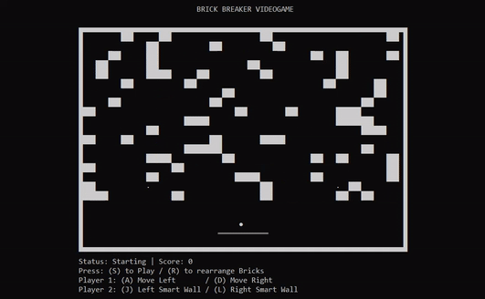

# 2 PLAYERS BRICK BREAKER VIDEOGAME

Delivered version of Brick Breaker videogame for Cardano Developer Program (EMURGO)




## Installation

Clone this repository and run cabal

```bash
git clone https://github.com/gerardVM/brick-breaker.git &&
cd brick-breaker &&
cabal run
```
or clone this repository and build the Docker image from the Dockerfile
```bash
git clone https://github.com/gerardVM/brick-breaker.git &&
cd brick-breaker &&
docker build -t brick-breaker . &&
docker run --rm -it brick-breaker
```
or run the pre-built Docker image
```bash
docker run --rm -it gerardvm/brick-breaker
```

## Usage

Player 1's objective is to break all the bricks by avoiding the ball to touch the floor

Controls for player 1: 
- A - Left (Same key for Move and Stop) 
- D - Right (Same key for Move and Stop)
- SPACE - Auto Mode

Player 2's objective is to make it harder (or easier) to player 1 by enabling EITHER the Left Smart Wall or the Right Smart Wall

Controls for player 2: 
- J - Left Wall (Same key for Enable and Disable)
- L - Right Wall (Same key for Enable and Disable)

## Contributing

Pull requests are welcome

## License

[MIT](LICENSE.txt)
